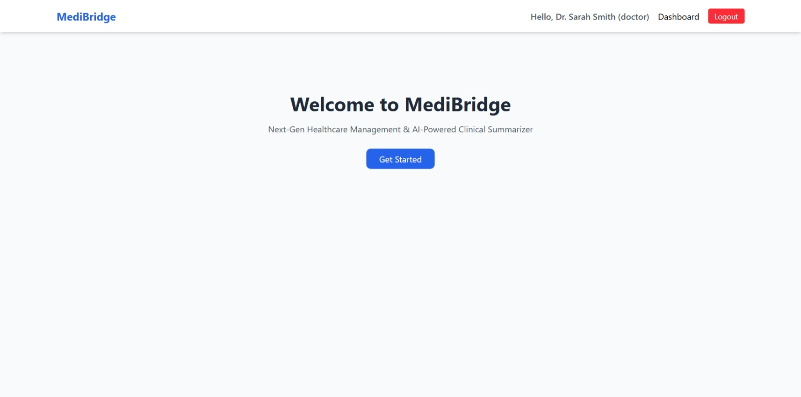

# 🏥 MediBridge - Healthcare Appointment & Follow-up Manager

A comprehensive full-stack healthcare appointment platform with separate portals for patients, doctors, and system administrators. 
Features AI symptom summaries, robust concurrency control for double-booking prevention, automated leave conflict management, and beautiful interactive dashboards.

## 📸 Screenshots

### Login Portal


### Patient Portal



### Doctor Portal


### Admin Portal


## 📁 File Structure

```text
HealthCare-Appointment/
├── backend/
│   ├── src/
│   │   ├── config/          # Database connection
│   │   ├── controllers/     # Route logic
│   │   ├── middlewares/     # Auth and error handling
│   │   ├── models/          # Mongoose schemas
│   │   ├── routes/          # Express API routes
│   │   ├── scripts/         # DB seed scripts
│   │   ├── services/        # AI, Calendar, Cron, Email services
│   │   └── index.ts         # Server entry point
│   ├── package.json
│   └── tsconfig.json
├── frontend/
│   ├── src/
│   │   ├── components/      # Reusable UI components (Navbar, etc.)
│   │   ├── pages/           # Admin, Doctor, Patient Dashboards & Login
│   │   ├── App.tsx          # Main React router
│   │   └── main.tsx         # React entry point
│   ├── public/              # Static assets & favicons
│   ├── package.json
│   └── vite.config.ts
├── screenshots/             # Demo images for README
├── System_Design.md         # Architecture documentation
├── LICENSE                  # MIT License
└── README.md                # Project documentation
```

## ✨ Core Features

- **Role-Based Dashboards:** Distinct interactive portals for Patients, Doctors, and Admins.
- **Atomic Slot Holding:** Concurrency control prevents double-booking using a 5-minute atomic slot hold system during booking.
- **Doctor Leave Management:** Admins can instantly put doctors on leave. Conflicting appointments are automatically cancelled and users are notified.
- **AI Integration (Gemini):**
  - *Pre-Visit Summary:* AI analyzes patient symptoms during booking to determine urgency.
  - *Post-Visit Summary:* Doctors submit clinical notes which are converted into patient-friendly summaries and prescriptions.
- **Background Jobs:** Node-cron handles retry-able background jobs like email notifications and reminders.

## 🚀 Setup Guide

### Prerequisites
- Node.js (v18+)
- MongoDB (Local or Atlas)
- Google Gemini API Key

### 1. Clone the repository
```bash
git clone https://github.com/Arnavshukla09/HealthCare-Appointment.git
cd HealthCare-Appointment
```

### 2. Install Dependencies
This project uses a monorepo setup. You can install all dependencies from the root:
```bash
cd frontend && npm install
cd ../backend && npm install
```

### 3. Environment Variables
Create a `.env` file in the `backend` directory based on the provided `.env.example`:
```env
PORT=5000
MONGO_URI=mongodb+srv://<user>:<password>@cluster...
JWT_SECRET=supersecretjwtkey
GEMINI_API_KEY=your_gemini_api_key
```
*(Ensure you never commit your actual `.env` file to version control. The repository now properly ignores it).*

### 4. Seed the Database
To populate the database with demo users (Admin, Doctor, Patient), run the seed script:
```bash
cd backend
npm run build
node dist/scripts/seed.js
```

### 5. Run the Application
You can run the backend and frontend separately for development:

**Backend:**
```bash
cd backend
npm run dev
```

**Frontend:**
```bash
cd frontend
npm run dev
```
Open `http://localhost:5173` in your browser.

## 🗄️ Database Schema Summary

- **Users:** Stores authentication data and roles (`admin`, `doctor`, `patient`).
- **DoctorProfiles:** Links to `User`. Stores `specialization`, `workingHours`, `slotDuration`, and `leaveDays`.
- **Appointments:** Links to `patient` and `doctor`. Tracks `status` (`booked`, `completed`, `cancelled`), `holdExpiresAt` (with TTL index), and stores AI summaries.
- **Notifications:** Job queue for background email retries.

## 📡 API Documentation (Overview)

- `POST /api/auth/register` - Register a new user
- `POST /api/auth/login` - Authenticate and get JWT
- `GET /api/appointments` - Fetch appointments for the logged-in user
- `POST /api/appointments/hold` - Create a 5-minute atomic hold on a slot
- `POST /api/appointments/book` - Confirm booking and submit symptoms
- `POST /api/doctor/post-visit` - Doctor submits clinical notes for AI summary generation
- `GET /api/admin/users` - Admin fetch all users
- `DELETE /api/admin/users/:id` - Admin delete a user
- `POST /api/admin/doctor/leave` - Admin sets a doctor on leave, triggering auto-cancellation

## 📄 License

This project is licensed under the MIT License - see the [LICENSE](LICENSE) file for details.

Copyright (c) 2026 Arnav Shukla
